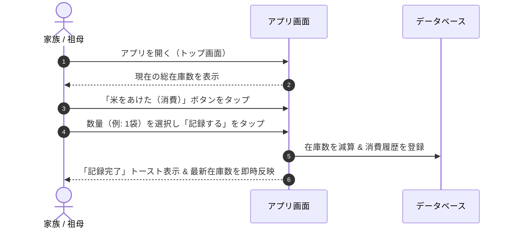
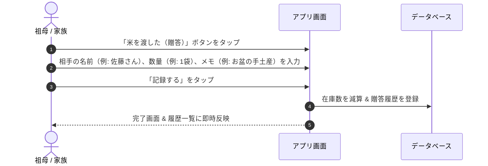

# ターゲットユーザー・ユースケース・スコープ定義書

本ドキュメントは、お米管理Webアプリ（`rice-management`）における想定ユーザー、代表的な利用シナリオ、および開発スコープ（MVPと将来構想）を定義したものです。

---

## 1. ターゲットユーザー・ペルソナ定義

本アプリは、主に家庭内（家族6名程度）での共同利用を前提としています。利用者のITリテラシーの差に配慮した設計が重要となります。

### ペルソナ1: 祖母（現在のメイン記録者・従来ノート管理者）
- **年代・属性**: 70代 / 在宅
- **ITリテラシー**: スマートフォンは電話、LINE、写真閲覧程度。細かい文字入力や複雑な階層メニューは苦手。
- **利用シーン**: 親戚へ米を渡した直後で居間や小屋、台所からスマホを操作。
- **ニーズ・課題**:
  - 紙ノートのように「パッと開いて、迷わず1〜2タップで記録したい」
  - ボタンや文字が大きく、分かりやすい表現（専門用語なし）が良い
- **主な役割**: 贈答（親戚に米を渡した記録）、現在の残数確認、過去の履歴の確認

### ペルソナ2: 家族メンバー（同居家族・子/孫世代）
- **年代・属性**: 20〜50代 / 日中は仕事や学校
- **ITリテラシー**: スマートフォンやPCの操作に慣れている
- **利用シーン**: 自宅の米ストックから新しい袋を開封したとき、外出先で親戚への配布状況を確認したいとき
- **ニーズ・課題**:
  - 「今年、叔父さんにはもう米を渡したか？」「いつ渡したか？」をすぐに検索したい
  - 自宅消費で袋を開けた時に数秒で記録を完了させたい
- **主な役割**: 自宅消費の記録、補充（収穫・精米・購入）の記録、過去履歴の検索

### ペルソナ3: アプリ管理者（開発者自身）
- **ニーズ・課題**:
  - 家族全員がログインしやすい認証の提供（パスワード紛失などのサポートコストを下げたい）
  - 品種や単位の変更など、必要に応じた設定のメンテナンス

---

## 2. コアユースケース（利用シナリオ）

### UC-01: 自宅での米の消費記録（最も頻度が高いシナリオ）

- **詳細**: ストック保管場所（保冷庫）から米櫃へ新しい米袋を移動した際に記録。入力項目は極力「数量」のみ（デフォルト1袋(30kg)、日付は本日自動補完）。

---

### UC-02: 親戚・知人への贈答記録

- **詳細**: 誰にいつ渡したかが記録されるため、後から「今年あの人に渡したっけ？」という確認が可能になる。

---

### UC-03: 米の補充（新米収穫）
- **シナリオ**: 秋の新米収穫時に在庫を増やす。
- **入力項目**: 補充数量（例: 30kg袋 × 10袋）、日付、メモ（例: 令和8年度新米あきたこまち）。

---

### UC-04: 在庫数と過去履歴の確認・検索
- **シナリオ**:
  - 「今月の残りは足りるか？」→ トップ画面の在庫メーター/数字を一目で確認。
  - 「叔父さんに前回渡したのはいつだっけ？」→ 履歴検索で「叔父」と検索し、過去の贈答日と数量を閲覧。

---

## 3. プロダクトスコープ定義

「シンプルで家族全員が挫折せず毎日使えること」を最優先とし、初期リリース（MVP）と将来機能（Phase 2以降）を明確に線引きします。

| 区分 | 機能・要件項目 | MVP（初期リリース） | Phase 2（将来構想） | 備考 |
| :--- | :--- | :---: | :---: | :--- |
| **在庫表示** | 現在の総在庫数の一目表示（袋数 / kg） | **必須 (Must)** | - | トップ画面最上部に大きく表示 |
| **入出庫操作** | 「自宅消費」の減算記録 | **必須 (Must)** | - | 1タップ＋数量確認の最速入力 |
| **入出庫操作** | 「贈答（渡した）」の減算記録 | **必須 (Must)** | - | 相手先名・日付・数量・メモ |
| **入出庫操作** | 「補充（入庫）」の加算記録 | **必須 (Must)** | - | 数量・日付・メモ |
| **履歴閲覧** | 入出庫履歴一覧の表示（日付順） | **必須 (Must)** | - | 誰に・何を・どれだけが分かる |
| **履歴検索** | 贈答先名やメモでのキーワード絞り込み | **必須 (Must)** | - | 「○○さんに渡した履歴」の確認用 |
| **履歴編集** | 誤入力時の履歴修正・削除 | **必須 (Must)** | - | 誤タップ時のリカバリ用 |
| **認証** | 家族専用の簡易ログイン認証 | **必須 (Must)** | - | 家族共通パスワードまたは簡易アカウント |
| **マスタ管理** | 贈答先（親戚等）マスタ管理（`MST-01`） | **必須 (Must)** | - | 登録済み候補からのワンタップ選択で祖母の入力負荷を軽減（直接入力も可） |
| **マスタ管理** | 家族メンバーマスタ管理（`MST-02`） | **必須 (Must)** | - | 家族構成員の登録、ログインしたユーザーが登録更新したユーザーとして
記録される|

---

## 4. 前提条件と制約事項

1. **モバイルファースト（祖母対応UI）**:
   - スマートフォンの縦画面で片手操作できる配置。
   - ボタンサイズは48px以上、フォントサイズは大きめ（16px以上、数字は24px以上）を基準とする。
2. **操作の短縮（入力ストレスの極小化）**:
   - 最も多い「消費（1袋）」は最短2タップ（ボタン押下→確定）で完了できるようにする。
3. **データ消失防止**:
   - 誤操作で在庫数が狂わないよう、削除・大量減算時には確認ダイアログを設ける。
   - 履歴データの論理削除または監査ログを残せる構造とする。
