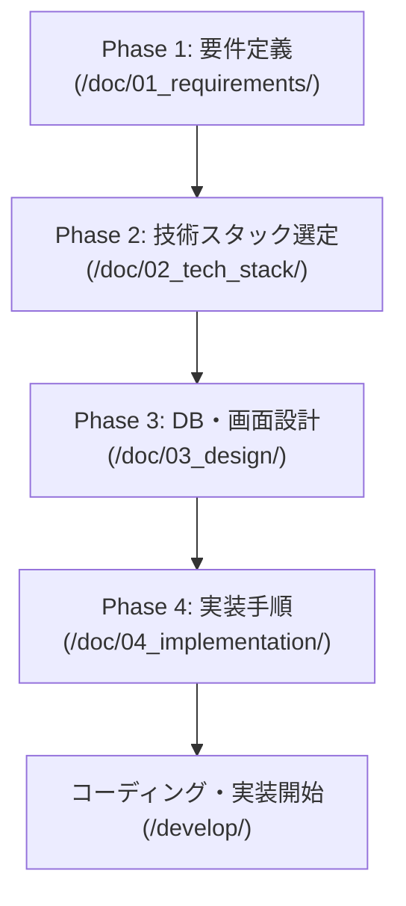

# Webアプリケーション開発 ToDo & 設計ロードマップ

本ドキュメントは、Webアプリケーションの企画・設計から実装・リリースまでの全工程を整理した進捗管理・タスクリストです。  
各フェーズごとに論点を決定し、指定の設計ドキュメントを作成しながら開発を進めます。

---

## 1. 開発ロードマップ & 進捗サマリー



| フェーズ | ディレクトリ名 | 目的・概要 | ステータス |
| :--- | :--- | :--- | :--- |
| **Phase 1: 要件定義** | [`/doc/01_requirements/`](./01_requirements/) | 「誰のどんな課題を解決するか」「何を作るか」の定義 | 進行中 (1/4 完了) |
| **Phase 2: 技術スタック選定** | [`/doc/02_tech_stack/`](./02_tech_stack/) | 要件を満たす言語、フレームワーク、DB、インフラの選定 | 未着手 |
| **Phase 3: DB・画面設計** | [`/doc/03_design/`](./03_design/) | データ構造、画面遷移、UI、API、認証の具体化 | 未着手 |
| **Phase 4: 実装手順** | [`/doc/04_implementation/`](./04_implementation/) | 開発環境セットアップ、タスク分割(WBS)、リリースまでの手順策定 | 未着手 |

---

## 2. ディレクトリ & ファイル構成

各フェーズごとのやること（論点）の分類に応じて、以下のディレクトリおよびファイルを作成・管理します。

```text
doc/
├── todo.md                            # [本ファイル] 全体進捗管理・ToDoリスト
│
├── 01_requirements/                   # 【Phase 1】要件定義（進行中: 1/4）
│   ├── 01_overview.md                 # [完了] プロジェクト概要・背景・解決する課題・目的
│   ├── 02_user_and_scope.md           # ターゲットユーザー・ペルソナ・スコープ(MVP/将来)
│   ├── 03_functional_requirements.md  # 機能要件一覧・優先度・各機能の詳細
│   └── 04_non_functional_req.md       # 非機能要件（性能・セキュリティ・対応端末・可用性）
│
├── 02_tech_stack/                     # 【Phase 2】技術スタック選定
│   ├── 01_architecture.md             # 全体アーキテクチャ方針（モノリス/SPA+API等）
│   ├── 02_frontend.md                 # フロントエンド選定（言語/フレームワーク/UIライブラリ）
│   ├── 03_backend.md                  # バックエンド選定（言語/フレームワーク/ORM）
│   ├── 04_database.md                 # データベース・ストレージ選定
│   └── 05_infra_devops.md             # インフラ・ホスティング・CI/CD・開発ツール
│
├── 03_design/                         # 【Phase 3】DB・画面設計
│   ├── 01_data_model.md               # データモデル・ER図・テーブル定義・制約
│   ├── 02_screen_flow.md              # 画面一覧・画面遷移図
│   ├── 03_ui_wireframes.md            # 画面レイアウト・ワイヤーフレーム・UI状態仕様
│   ├── 04_api_design.md               # API仕様（エンドポイント一覧・入出力定義・エラー形式）
│   └── 05_auth_security.md            # 認証・認可フロー・権限マトリクス・セキュリティ設計
│
└── 04_implementation/                 # 【Phase 4】実装手順
    ├── 01_setup_guide.md              # 開発環境構築手順・環境変数仕様
    ├── 02_milestones_wbs.md           # マイルストーン・タスク分解（WBS）・依存関係
    ├── 03_implementation_steps.md    # フェーズ別実装ステップ詳細（基盤→コア→応用）
    └── 04_test_and_deploy.md          # テスト計画・QA・デプロイ/リリース手順
```

---

## 3. 各フェーズの詳細論点とタスク一覧

---

### Phase 1: 要件定義
- **格納ディレクトリ**: `doc/01_requirements/`
- **目的**: プロジェクトの目的を言語化し、作るべきものの境界線（スコープ）を明確にする。

#### 1. プロジェクト概要・目的・背景 (✅ 作成完了)
- **作成ファイル**: `doc/01_requirements/01_overview.md`
- **決めるべき論点**:
  - なぜこのWebアプリを作るのか？（解決したい課題やペイン、動機）
  - アプリが提供するコアバリュー（ユーザーが得られるメリット）は何か？
  - プロジェクトの成功指標（KPI、MVP完成基準など）は何か？
- **タスクリスト**:
  - [x] 課題の洗い出しと背景の整理
  - [x] アプリのビジョン・解決方針の明確化
  - [x] 成功基準（定量的・定性的なゴール）の設定

#### 2. ユーザー定義・ユースケース・スコープ
- **作成ファイル**: `doc/01_requirements/02_user_and_scope.md`
- **決めるべき論点**:
  - 想定ユーザー（ペルソナ：属性、ITリテラシー、利用シーン）は誰か？
  - 主要なユースケース（ユーザーが目的を達成するまでの代表的な利用シナリオ）は何か？
  - 最小限の製品（MVP）に含める範囲と、次回以降に回す将来スコープの線引きはどうするか？
- **タスクリスト**:
  - [ ] ターゲットユーザー（ペルソナ）の具体化
  - [ ] 代表的なユースケース（ユーザー行動フロー）の策定
  - [ ] MVPスコープ（初期リリース必須機能）の切り出し
  - [ ] 将来機能（フェーズ2以降で対応するもの）のリストアップ

#### 3. 機能要件
- **作成ファイル**: `doc/01_requirements/03_functional_requirements.md`
- **決めるべき論点**:
  - アプリに必要な機能の網羅（CRUD、一覧表示、検索・ソート、集計、通知など）
  - 各機能の優先度（Must: 必須 / Should: 推奨 / Nice-to-have: あれば良い）
  - 権限ごとの機能差分（一般ユーザー、管理者、未ログインゲスト）
- **タスクリスト**:
  - [ ] 機能一覧リストの作成と優先度付け
  - [ ] 各機能の入力・処理・出力の概要整理
  - [ ] バリデーションルールや例外時の要件整理

#### 4. 非機能要件
- **作成ファイル**: `doc/01_requirements/04_non_functional_req.md`
- **決めるべき論点**:
  - 対応デバイス・ブラウザ（PC中心、スマホレスポンシブ、PWAなど）
  - パフォーマンス目標（ページ表示速度、同時アクセス想定）
  - セキュリティ基準（パスワードポリシー、暗号化、個人情報の有無）
  - 運用・可用性要件（バックアップ頻度、ダウンタイム許容度）
- **タスクリスト**:
  - [ ] 想定デバイス（モバイル/PC）および対応ブラウザの決定
  - [ ] レスポンス性能やデータ規模の想定値整理
  - [ ] セキュリティ方針の明確化
  - [ ] バックアップ・データ保持期間方針の策定

---

### Phase 2: 技術スタック選定
- **格納ディレクトリ**: `doc/02_tech_stack/`
- **目的**: 要件を実現するために最も費用対効果・開発速度・拡張性のバランスが良い技術を選定する。

#### 1. 全体アーキテクチャ方針
- **作成ファイル**: `doc/02_tech_stack/01_architecture.md`
- **決めるべき論点**:
  - システム構成方針（モノリス / フロントエンド・バックエンド完全分離 / サーバーレス / フルスタックフレームワーク）
  - レンダリング方針（SSR / CSR / SSG / ISR）
  - フロント・バックエンド間の通信プロトコル（REST API / GraphQL / RPC等）
- **タスクリスト**:
  - [ ] 全体システム構成図の作成
  - [ ] レンダリングおよび通信方針の決定
  - [ ] プロジェクトのディレクトリ構成標準の定義

#### 2. フロントエンド選定
- **作成ファイル**: `doc/02_tech_stack/02_frontend.md`
- **決めるべき論点**:
  - 言語（TypeScript / JavaScript）
  - フレームワーク（Next.js / Nuxt / React+Vite / Vue / Svelte等）
  - CSSスタイリング・UIライブラリ（Tailwind CSS / shadcn/ui / MUI / Mantine等）
  - フォーム管理・バリデーションライブラリ（React Hook Form + Zod等）
  - 状態管理ライブラリ（Zustand / Redux / TanStack Query等）
- **タスクリスト**:
  - [ ] フロントエンド言語・フレームワークの選定と理由の記録
  - [ ] UIライブラリおよびスタイリング手法の決定
  - [ ] フォーム管理・バリデーション手法の決定
  - [ ] クライアント状態・サーバーキャッシュ管理手法の選定

#### 3. バックエンド選定
- **作成ファイル**: `doc/02_tech_stack/03_backend.md`
- **決めるべき論点**:
  - 言語（TypeScript, Go, Python等）
  - フレームワーク（Next.js Route Handlers, Express, NestJS, FastAPI, Hono等）
  - ORM / クエリビルダー（Prisma, Drizzle, SQLAlchemy等）
  - ロギング・エラー監視方針
- **タスクリスト**:
  - [ ] バックエンド実行環境・フレームワークの決定
  - [ ] ORM / データアクセスライブラリの選定
  - [ ] API設計規約（REST原則・エラーレスポンス共通化）の策定

#### 4. データベース・ストレージ選定
- **作成ファイル**: `doc/02_tech_stack/04_database.md`
- **決めるべき論点**:
  - データベース種別（RDBMS: PostgreSQL, MySQL, SQLite / NoSQL: MongoDB, Firestore）
  - ホスティングサービス（Supabase, Neon, PlanetScale, AWS RDS, ローカルDocker等）
  - ファイルストレージ（S3, Cloudflare R2, Supabase Storage等 ※画像・ファイル保存がある場合）
  - キャッシュ層（Redis等）の要否
- **タスクリスト**:
  - [ ] 主力データベースの選定と選定理由の記載
  - [ ] DBホスティングサービスの決定
  - [ ] ファイルストレージ要否の判断と選定
  - [ ] マイグレーションツールの確定

#### 5. インフラ・ホスティング・CI/CD・開発ツール
- **作成ファイル**: `doc/02_tech_stack/05_infra_devops.md`
- **決めるべき論点**:
  - ホスティング環境（Vercel, Cloudflare Pages/Workers, Render, AWS, GCP等）
  - CI/CDパイプライン（GitHub Actionsによる自動テスト・自動ビルド・デプロイ）
  - 開発環境（Docker利用の有無、ローカル実行環境）
  - リンター・コードフォーマッタ（ESLint, Prettier, Biome等）
- **タスクリスト**:
  - [ ] ホスティング環境・デプロイ方式の決定
  - [ ] ドメイン・SSL運用の決定
  - [ ] CI/CDワークフロー（Lint・Test・Deploy）の設計
  - [ ] コード品質ツール（Linter/Formatter/Git hooks）の選定

---

### Phase 3: DB・画面設計
- **格納ディレクトリ**: `doc/03_design/`
- **目的**: 実装に着手できるレベルまで、データの持ち方と画面の振る舞いを明確に定義する。

#### 1. データモデル・ER図・テーブル定義
- **作成ファイル**: `doc/03_design/01_data_model.md`
- **決めるべき論点**:
  - 必要なエンティティ（テーブル）とそれらのリレーション（1:1, 1:N, N:M）
  - 各テーブルのカラム構成、データ型、NULL許容、デフォルト値
  - 共通カラム（id, created_at, updated_at, deleted_at等）の方針
  - インデックス・ユニークキー・外部キー制約
- **タスクリスト**:
  - [ ] エンティティの洗い出しと関連性の整理
  - [ ] MermaidによるER図の作成
  - [ ] テーブル定義書（論理名/物理名/型/制約/備考）の作成
  - [ ] パフォーマンスを考慮したインデックス設計

#### 2. 画面一覧・画面遷移図
- **作成ファイル**: `doc/03_design/02_screen_flow.md`
- **決めるべき論点**:
  - アプリケーションに存在する全画面（URLパス、画面名、アクセス権限）
  - 画面間の遷移導線（どのボタン・リンクでどこへ移動するか）
  - 認証状態（未ログイン/ログイン済み/管理者）によるリダイレクト・アクセス制御
- **タスクリスト**:
  - [ ] 画面一覧リストの作成（画面ID、画面名、パス、公開範囲）
  - [ ] Mermaidによる画面遷移フロー図の作成
  - [ ] モーダル表示やタブ切り替えなどの画面内遷移パターンの整理

#### 3. 画面詳細・UIワイヤーフレーム
- **作成ファイル**: `doc/03_design/03_ui_wireframes.md`
- **決めるべき論点**:
  - 共通レイアウト構造（ヘッダー、ナビゲーション、サイドバー、フッター）
  - 各主要画面のコンポーネント配置・入力項目・アクションボタン
  - UI状態（通常時、ローディング中、エラー時、データ0件のEmpty State）の表示
- **タスクリスト**:
  - [ ] 共通レイアウト構成の定義
  - [ ] 主要画面のワイヤーフレーム（テキスト表現、Mermaid、ASCIIアート等）の作成
  - [ ] 入力フォームのエラー表示・トースト通知表示パターンの定義
  - [ ] Empty State（データ未登録時）の表示仕様検討

#### 4. API設計
- **作成ファイル**: `doc/03_design/04_api_design.md`
- **決めるべき論点**:
  - エンドポイント設計（URL、HTTPメソッド、概要）
  - リクエストパラメータ（パスパラメータ、クエリ、ボディ）の仕様
  - レスポンスデータ構造（成功時レスポンスJSON）
  - エラーレスポンス共通フォーマット（HTTPステータス、エラーコード、メッセージ）
- **タスクリスト**:
  - [ ] APIエンドポイント一覧表の作成
  - [ ] 各APIのリクエスト/レスポンス仕様（JSONスキーマ）の定義
  - [ ] 共通エラーレスポンスフォーマットの策定
  - [ ] ページネーション・ソート・絞り込みの共通規約策定

#### 5. 認証・認可・セキュリティ設計
- **作成ファイル**: `doc/03_design/05_auth_security.md`
- **決めるべき論点**:
  - 認証方式（パスワード認証、ソーシャルログイン、マジックリンク、二要素認証など）
  - セッション/トークン管理方式（Cookieベース、JWT、セッションID等）
  - 権限管理（ロールベースアクセス制御: RBAC）
  - セキュリティ対策仕様（CSRF, XSS, CORS, レート制限, 入力サニタイズ）
- **タスクリスト**:
  - [ ] 認証フロー（新規登録・ログイン・ログアウト・パスワードリセット）の定義
  - [ ] ユーザーロールごとの権限マトリクス（CRUD可否表）の作成
  - [ ] セッション有効期限・リフレッシュトークン運用の決定
  - [ ] セキュリティチェックリストの作成

---

### Phase 4: 実装手順
- **格納ディレクトリ**: `doc/04_implementation/`
- **目的**: 手戻りなくスムーズにコードを書き進められるよう、実装の順番・手順を具体化する。

#### 1. 開発環境構築手順・環境変数仕様
- **作成ファイル**: `doc/04_implementation/01_setup_guide.md`
- **決めるべき論点**:
  - 必要な前提ソフトウェア・ランタイムバージョン（Node.js, Docker, pnpm等）
  - 依存ライブラリのインストール・初期化コマンド
  - 環境変数（`.env`）のキー名一覧と設定例
  - ローカル開発サーバーおよびローカルDBの起動手順
- **タスクリスト**:
  - [ ] 前提環境・ツールの明記
  - [ ] `.env.example` の作成と各環境変数の説明
  - [ ] 初回セットアップコマンド（インストール・DB作成・シード投入）の手順書化
  - [ ] トラブルシューティング（よくあるエラーと対処法）の記載

#### 2. マイルストーン・タスク分解（WBS）
- **作成ファイル**: `doc/04_implementation/02_milestones_wbs.md`
- **決めるべき論点**:
  - 実装の全体フェーズ分け（基盤構築 → コア機能 → 付加機能 → リリース準備）
  - 各タスクの依存関係（何が終わらないと次に進めないか）
  - マイルストーンごとの完了条件（Definition of Done: DoD）
- **タスクリスト**:
  - [ ] 全マイルストーン（M1〜M4）の定義とゴール設定
  - [ ] タスク依存関係マップの整理
  - [ ] 各タスクの工数・難易度見積もり

#### 3. フェーズ別実装ステップ詳細
- **作成ファイル**: `doc/04_implementation/03_implementation_steps.md`
- **決めるべき論点**:
  - Step 1: プロジェクト初期化 & 共通基盤（ディレクトリ、Linter、共通レイアウト、UIコンポーネント）
  - Step 2: データベース設計のコード化（Prisma/Drizzle等のスキーマ定義・マイグレーション実行）
  - Step 3: 認証基盤・ユーザー管理機能の実装
  - Step 4: メイン機能のCRUD実装（バックエンドAPI → フロントエンド接続）
  - Step 5: 検索・集計・フィルタリング機能の実装
  - Step 6: UX向上（ローディングUI、エラーハンドリング、トースト通知、確認ダイアログ）
- **タスクリスト**:
  - [ ] Step 1: 基盤構築のコード実装手順チェックリスト
  - [ ] Step 2: DBスキーマ・シードデータの作成手順
  - [ ] Step 3: 認証・認可ミドルウェアの実装手順
  - [ ] Step 4: コア機能実装手順の細分化
  - [ ] Step 5: サブ機能・UIブラッシュアップ手順の細分化

#### 4. テスト計画・QA・デプロイ手順
- **作成ファイル**: `doc/04_implementation/04_test_and_deploy.md`
- **決めるべき論点**:
  - テスト戦略（単体テスト、コンポーネントテスト、結合テスト、E2Eテストの比率）
  - リリース前QAチェックリスト（動作確認、バリデーション、レスポンシブ崩れ等）
  - 本番デプロイ手順（DBマイグレーション実行手順、環境変数反映、ロールバック方針）
- **タスクリスト**:
  - [ ] テスト方針の決定（Vitest, Jest, Playwright等）
  - [ ] リリース前確認チェックシートの作成
  - [ ] 本番デプロイ手順書の作成（初回到達〜継続的デプロイ）
  - [ ] リリース後の監視・ヘルスチェック方針の策定

---

## 4. 進め方のガイド

1. **上流から順番に進める**:  
   原則として `01_requirements` → `02_tech_stack` → `03_design` → `04_implementation` の順序で確定させていきます。
2. **随時ToDoのチェックを入れる**:  
   各ファイルを作成・検討が完了したら、本ファイルの `[ ]` を `[x]` に更新して進捗を可視化します。
3. **アジャイルな手戻りを許容する**:  
   技術選定や画面設計を進める中で要件の調整が必要になった場合は、該当する要件定義ファイルを更新し、本ToDoリストのスコープを随時アップデートしてください。
